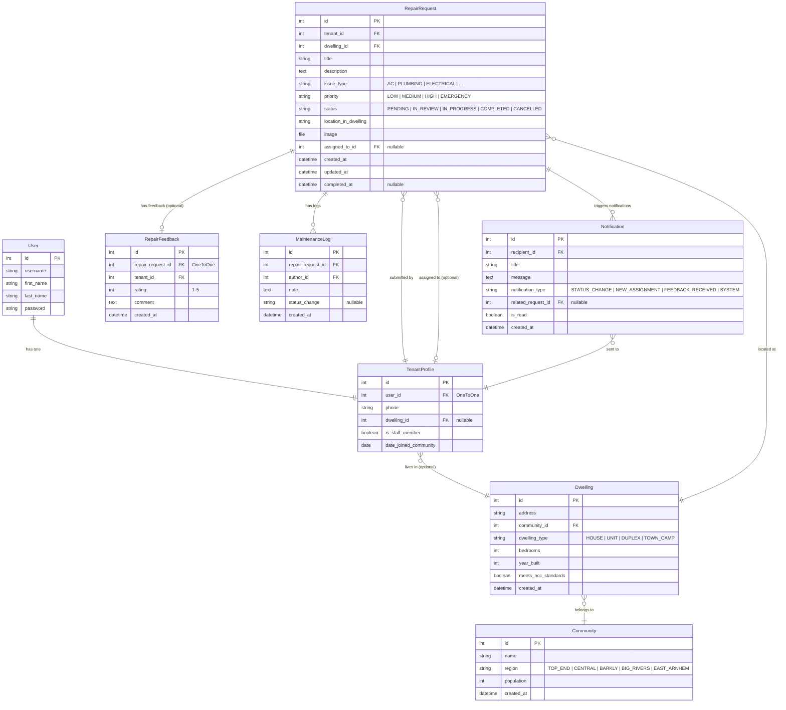
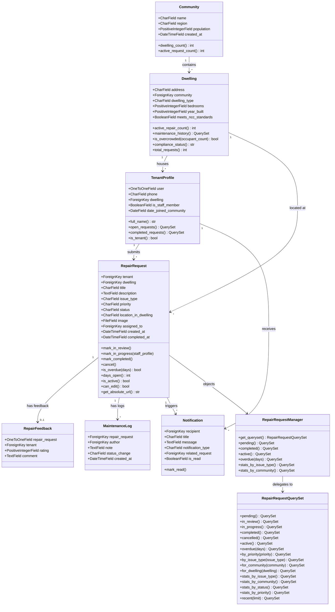
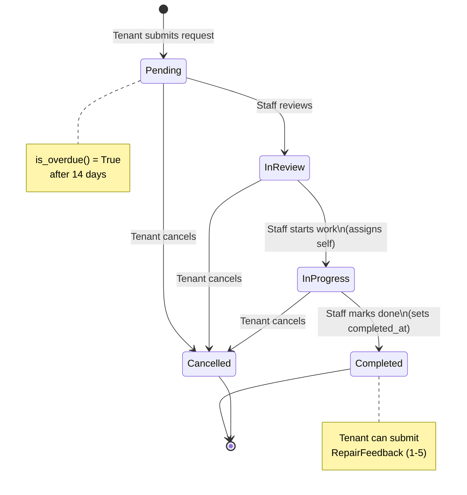

# Supplementary Materials

## NT Remote Housing Repair System

---

## 1. Entity-Relationship Diagram (ERD)



---

## 2. Class Diagram (Application Architecture)



---

## 3. View Architecture Diagram

```mermaid
classDiagram
    direction TB

    class LoginRequiredMixin {
        <<Django Built-in>>
    }

    class LoginRequiredWithMessageMixin {
        +login_url = "login"
        +handle_no_permission()
    }

    class StaffRequiredMixin {
        +dispatch(request)
    }

    class TenantRequiredMixin {
        +dispatch(request)
    }

    LoginRequiredMixin <|-- LoginRequiredWithMessageMixin
    LoginRequiredWithMessageMixin <|-- StaffRequiredMixin
    LoginRequiredWithMessageMixin <|-- TenantRequiredMixin

    class ListView {
        <<Django Generic>>
    }
    class DetailView {
        <<Django Generic>>
    }
    class CreateView {
        <<Django Generic>>
    }
    class UpdateView {
        <<Django Generic>>
    }
    class DeleteView {
        <<Django Generic>>
    }
    class TemplateView {
        <<Django Generic>>
    }

    class RepairRequestListView {
        +model = RepairRequest
        +paginate_by = 10
        +get_queryset()
        +get_context_data()
    }
    class RepairRequestCreateView {
        +model = RepairRequest
        +form_class = RepairRequestForm
        +form_valid(form)
    }
    class RepairRequestDetailView {
        +model = RepairRequest
        +get_queryset()
        +get_context_data()
    }
    class RepairRequestUpdateView {
        +model = RepairRequest
        +form_class = RepairRequestForm
        +form_valid(form)
    }
    class RepairRequestDeleteView {
        +model = RepairRequest
        +success_url
        +form_valid(form)
    }
    class CommunityListView {
        +model = Community
        +paginate_by = 12
        +get_queryset()
    }
    class CommunityDetailView {
        +model = Community
        +get_context_data()
    }
    class DwellingListView {
        +model = Dwelling
        +paginate_by = 15
        +get_queryset()
    }
    class DwellingDetailView {
        +model = Dwelling
        +get_context_data()
    }
    class TenantDashboardView {
        +get_context_data()
    }
    class StaffDashboardView {
        +get_context_data()
    }
    class AnalyticsView {
        +get_context_data()
    }
    class NotificationListView {
        +model = Notification
        +paginate_by = 20
        +get_queryset()
    }

    LoginRequiredWithMessageMixin <|-- RepairRequestListView
    ListView <|-- RepairRequestListView

    TenantRequiredMixin <|-- RepairRequestCreateView
    CreateView <|-- RepairRequestCreateView

    LoginRequiredWithMessageMixin <|-- RepairRequestDetailView
    DetailView <|-- RepairRequestDetailView

    TenantRequiredMixin <|-- RepairRequestUpdateView
    UpdateView <|-- RepairRequestUpdateView

    TenantRequiredMixin <|-- RepairRequestDeleteView
    DeleteView <|-- RepairRequestDeleteView

    StaffRequiredMixin <|-- CommunityListView
    ListView <|-- CommunityListView

    StaffRequiredMixin <|-- CommunityDetailView
    DetailView <|-- CommunityDetailView

    StaffRequiredMixin <|-- DwellingListView
    ListView <|-- DwellingListView

    LoginRequiredWithMessageMixin <|-- DwellingDetailView
    DetailView <|-- DwellingDetailView

    TenantRequiredMixin <|-- TenantDashboardView
    TemplateView <|-- TenantDashboardView

    StaffRequiredMixin <|-- StaffDashboardView
    TemplateView <|-- StaffDashboardView

    StaffRequiredMixin <|-- AnalyticsView
    TemplateView <|-- AnalyticsView

    LoginRequiredWithMessageMixin <|-- NotificationListView
    ListView <|-- NotificationListView
```



---

## 4. Request Status Lifecycle (State Machine)



---

## 5. Django Design Philosophies Demonstrated

The following Django design philosophies are explicitly implemented in this project. References are to the [Django Design Philosophies documentation](https://docs.djangoproject.com/en/5.1/misc/design-philosophies/).

### Philosophy 1: Loose Coupling

> "A fundamental goal of Django's stack is loose coupling and tight cohesion."

Each layer of the application is independent and communicates through well-defined interfaces:

| Layer | Responsibility | Coupling Point |
|-------|---------------|----------------|
| **Models** (`models.py`) | Data + domain logic | Knows nothing about views or templates |
| **Views** (`views.py`) | HTTP handling + routing | Uses model methods, not raw SQL |
| **Forms** (`forms.py`) | Validation + transformation | Independent of views that use them |
| **Signals** (`signals.py`) | Cross-cutting concerns | Decoupled from both models and views |
| **Templates** | Presentation only | Receives context dict, no direct model access |
| **Mixins** (`mixins.py`) | Access control | Composable via MRO, independent of view logic |

**Evidence:** The `notify_on_status_change` signal (`signals.py:15–43`) fires on any `RepairRequest` save — whether triggered by a view, admin action, management command, or test. The model methods (`mark_in_review()`, etc.) have no knowledge of notifications. This is loose coupling in practice.

### Philosophy 2: Don't Repeat Yourself (DRY)

> "Every distinct concept and/or piece of data should live in one, and only one, place."

| What | Single Source of Truth | Where |
|------|----------------------|-------|
| "Active request" definition | `RepairRequestQuerySet.active()` | `managers.py:24–26` |
| Status → CSS class mapping | `status_class` filter | `templatetags/repair_tags.py:7–16` |
| User role + notification count | `global_context` processor | `context_processors.py:4–14` |
| Profile invariant | `ProfileEnforcementMiddleware` | `middleware.py:1–28` |
| Role-based access (CBV) | `StaffRequiredMixin` / `TenantRequiredMixin` | `mixins.py:25–52` |

**Evidence:** Changing the definition of "overdue" from 14 to 21 days requires editing one line (`managers.py:34`). Every dashboard, list view, and analytics page that uses `overdue()` automatically reflects the change.

### Philosophy 3: Explicit is Better Than Implicit

> "Django shouldn't do too much magic. Magic shouldn't happen unless there's a really good reason for it."

- Every model relationship uses an **explicit `on_delete`** behaviour and **explicit `related_name`** (`models.py:55`, `102`, `106`, `182`, `185`, `201`, `267`, `270`, etc.)
- Every `save()` call uses **`update_fields`** to make clear exactly which columns are being written (`models.py:220`, `225`, `230`, `234`)
- Custom managers expose an **explicit public API** — not every QuerySet method is exposed on the Manager (`managers.py:81–109`)
- Access control uses **explicitly named mixins/decorators** rather than relying on Django's implicit permission framework

### Philosophy 4: Models Should Encapsulate Every Aspect of an Object

> "Models should encapsulate every aspect of an 'object', following Martin Fowler's Active Record design pattern."

The `RepairRequest` model doesn't just store data — it encapsulates the **complete domain concept** of a repair request:

- **State transitions:** `mark_in_review()`, `mark_in_progress()`, `mark_completed()`, `cancel()` — (`models.py:222–238`)
- **Business rules:** `can_edit` (only pending), `is_active` (not completed/cancelled), `is_overdue` (pending > N days) — (`models.py:242–261`)
- **Computed data:** `days_open` — (`models.py:248–252`)
- **Query interface:** Custom manager with domain-specific queries — (`managers.py:81–109`)
- **Self-referencing URL:** `get_absolute_url()` — (`models.py:217–218`)

Similarly, `Dwelling` encapsulates occupancy logic (`is_overcrowded`), compliance status (`compliance_status`), and maintenance history (`maintenance_history`).

### Philosophy 5: Efficiency — Minimal Database Hits

> "Django's database layer provides various ways to help developers get the best performance out of their databases."

- **`select_related()`** used on every view that traverses ForeignKey chains to avoid N+1 queries (`views.py:401–403`, `488–490`, `500`, `586–590`)
- **`QuerySet.iterator()`** in CSV export for constant memory usage (`views.py:309`)
- **`update_fields`** on all model save operations to update only changed columns (`models.py:220`, `225`, `230`, `234`)
- **Annotations with `Count()`** instead of Python loops for community/dwelling statistics (`views.py:591–600`)
- **`StreamingHttpResponse`** for CSV export — rows sent as they're generated, not buffered in memory (`views.py:321`)

---

## 6. File Structure Overview

```
HIT237-BUILDING-INTERACTIVE-SOFTWARES/
├── config/                     # Project configuration
│   ├── settings.py             # Django settings
│   ├── urls.py                 # Root URL configuration
│   ├── wsgi.py                 # WSGI entry point
│   └── asgi.py                 # ASGI entry point
├── repairs/                    # Main application
│   ├── models.py               # 7 models (Fat Model pattern)
│   ├── views.py                # 13 CBVs + 15 FBVs
│   ├── urls.py                 # 29 URL patterns
│   ├── forms.py                # 8 form classes
│   ├── managers.py             # Custom QuerySet + Manager
│   ├── mixins.py               # CBV access-control mixins
│   ├── signals.py              # 2 signal handlers
│   ├── decorators.py           # 3 FBV decorators
│   ├── middleware.py            # Profile enforcement middleware
│   ├── context_processors.py   # Global template context
│   ├── admin.py                # 7 ModelAdmin registrations
│   ├── templatetags/
│   │   └── repair_tags.py      # Filters + inclusion tags
│   ├── management/
│   │   └── commands/
│   │       └── seed_data.py    # Database seeding command
│   └── tests.py                # 79 automated tests
├── templates/                  # 24 HTML templates
│   ├── base.html
│   ├── home.html
│   ├── auth/                   # Login, register, profile
│   ├── dashboard/              # Tenant + staff dashboards
│   ├── repairs/                # CRUD templates
│   ├── communities/            # Community list + detail
│   ├── dwelling/               # Dwelling list + detail
│   ├── analytics/              # Analytics dashboard
│   ├── notifications/          # Notification list
│   └── components/             # Reusable badge components
├── static/css/style.css        # 791 lines, dark theme
├── media/                      # User-uploaded repair images
├── ADR.md                      # Architectural Decision Records
├── SUPPLEMENTARY.md            # This file
├── Group Contract.md           # Team contract and project plan
├── Summary.md                  # Project summary
└── requirements.txt            # Python dependencies
```

---

## 7. Testing Summary

**79 automated tests** across 15 test classes:

| Test Class | Tests | Coverage Area |
|-----------|-------|---------------|
| `CommunityModelTest` | 2 | Model string representation, dwelling count property |
| `DwellingModelTest` | 4 | Compliance status, overcrowding check, active repair count |
| `TenantProfileModelTest` | 4 | Full name, role detection |
| `RepairRequestModelTest` | 14 | Status transitions, manager/queryset methods, overdue detection |
| `RegistrationFormTest` | 3 | Validation, password mismatch, duplicate username |
| `RepairRequestFormTest` | 2 | Valid form, required field validation |
| `ViewTest` | 10 | Home, login, register, dashboards, CRUD, status update |
| `SignalTest` | 3 | Auto-profile creation, notification on status change, no duplicates |
| `NotificationModelTest` | 3 | String representation, default unread, mark read |
| `RepairFeedbackModelTest` | 2 | String representation, rating storage |
| `ProfileViewTest` | 5 | Profile CRUD, password change |
| `CommunityViewTest` | 4 | Staff-only access, list/detail rendering |
| `AnalyticsViewTest` | 5 | Staff-only access, CSV export content-type and headers |
| `FeedbackViewTest` | 3 | Completed-only feedback, submission, duplicate prevention |
| `NotificationViewTest` | 3 | List, mark single read, mark all read |
| `LogoutViewTest` | 2 | GET does not logout, POST does |
| `CancelRequestViewTest` | 2 | Cancel success, cannot cancel completed |
| `ContextProcessorTest` | 2 | Unread count, user role in context |
